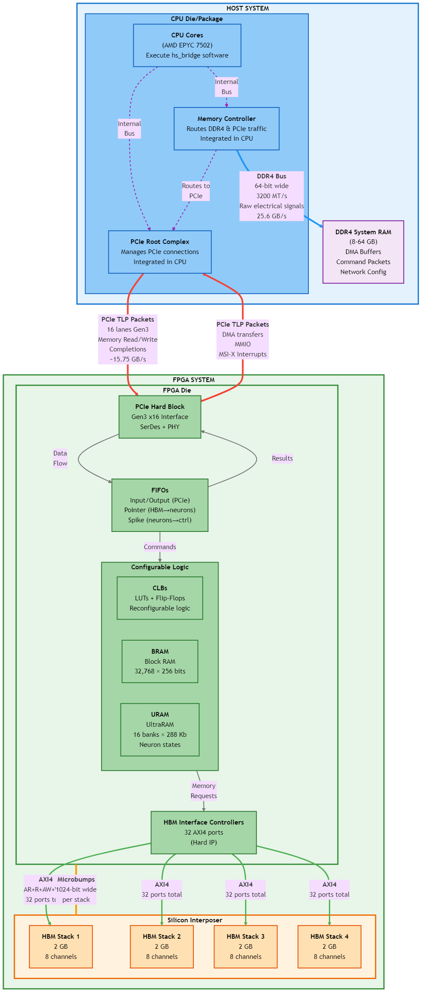

# Hardware System Architecture Diagram

This diagram shows the complete hardware system architecture including the host system, FPGA, and all communication pathways between components.



---

## Component Legend

### Processing Elements

**CPU Cores**
- Execute host software (hs_bridge)
- AMD EPYC 7502 processor
- Initiates DMA transfers and MMIO operations

**FPGA Logic**
- Reconfigurable hardware for neural network simulation
- Contains CLBs (Configurable Logic Blocks) with LUTs and Flip-Flops
- Runs at 225 MHz and 450 MHz clock domains

---

### Memory Elements

**DDR4 System RAM**
- Host memory (8-64 GB capacity)
- Stores DMA buffers, command packets, and network configuration
- Shared between CPU (direct access) and FPGA (via DMA)
- Bandwidth: 25.6 GB/s per channel

**HBM2 (High Bandwidth Memory)**
- FPGA's private high-speed memory
- 8 GB total capacity (4 stacks × 2 GB each)
- Bandwidth: 920 GB/s theoretical, ~400 GB/s practical
- Stores network structure (synapses, pointers, neuron data)

**BRAM (Block RAM)**
- On-chip FPGA memory
- Configuration: 32,768 addresses × 256 bits wide
- Stores spike masks for external events (axon activations)
- Fast access: 2-3 clock cycles

**URAM (UltraRAM)**
- Higher-density on-chip FPGA memory
- 16 banks × 288 Kb = 4.5 Megabits total
- Stores neuron state information (membrane potentials)
- Faster than BRAM: 1 clock cycle @ 450 MHz

---

### Interface Blocks

**Memory Controller**
- Integrated within CPU die
- Routes memory accesses between CPU cores, DDR4, and PCIe
- Translates PCIe requests to DDR4 operations
- Handles refresh and timing for DDR4

**PCIe Root Complex**
- Integrated within CPU die
- Manages PCIe connections and routing
- Routes TLP packets between CPU/memory and FPGA
- Provides bus mastering capability for DMA

**PCIe Hard Block**
- Fixed silicon block in FPGA (not reconfigurable)
- Gen3 x16 interface (16 lanes)
- Contains SerDes (Serializer/Deserializer) and PHY layer
- Enables FPGA to act as bus master for DMA

**HBM Interface Controllers**
- Hard IP blocks in FPGA
- Connect FPGA fabric to HBM stacks
- Provide 32 independent AXI4 ports (8 per stack)
- Handle timing-critical signaling to HBM

**FIFOs (First-In-First-Out Buffers)**
- **Input/Output FIFOs**: Buffer PCIe ↔ FPGA fabric transfers (512 bits wide)
- **Pointer FIFOs**: Distribute HBM addresses to processing units (32 bits wide)
- **Spike FIFOs**: Collect spike events from neurons (17 bits wide)
- Provide clock domain crossing and rate matching

---

## Communication Channels

### DDR4 Bus (Blue)

**Connection:** Memory Controller ↔ DDR4 RAM

**Protocol:** Raw electrical signals (not packetized)
- ACTIVATE: Open row in memory bank
- READ/WRITE: Access specific columns
- PRECHARGE: Close row

**Specifications:**
- Width: 64-bit data bus
- Speed: 3200 MT/s (mega-transfers per second)
- Bandwidth: 64 bits × 3200 MT/s = 25.6 GB/s

**Usage:**
- CPU writes/reads data (normal memory operations)
- FPGA accesses via DMA (memory controller translates PCIe to DDR4)
- Stores DMA buffers containing commands and network data

---

### PCIe TLP (Red)

**Connection:** FPGA ↔ CPU (via PCIe Root Complex)

**Protocol:** Transaction Layer Packets (TLPs)
- **Memory Write (Posted)**: CPU → FPGA MMIO, no response
- **Memory Read**: FPGA → Host memory, requires Completion TLP
- **Completion**: Host → FPGA, returns requested data
- **MSI-X Interrupt**: FPGA → Host, triggers CPU interrupt handler

**Specifications:**
- Configuration: 16 lanes, Gen3
- Speed: 8 Gb/s per lane raw, ~15.75 GB/s effective (after encoding)
- Bidirectional: Independent TX and RX per lane

**Usage:**
- DMA transfers (FPGA reading commands from host memory)
- MMIO register access (CPU configuring FPGA)
- Interrupts (FPGA notifying CPU of completion)

**TLP Structure:**
```
Header: Format, Type, Length, Address, Requester ID
Payload: 0 to 4096 bytes of data
```

---

### AXI4 Interface (Green)

**Connection:** FPGA Logic ↔ HBM2

**Protocol:** 5-channel AXI4 (Advanced eXtensible Interface)
- **AR (Read Address)**: Master requests data location
- **R (Read Data)**: Slave returns data
- **AW (Write Address)**: Master specifies write location
- **W (Write Data)**: Master sends data to write
- **B (Write Response)**: Slave acknowledges write completion

**Specifications:**
- Channels: 32 independent AXI4 ports total (8 per HBM stack)
- Width: Up to 256 bits per channel
- Handshake: VALID/READY protocol for flow control
- Bursts: Single address can request up to 256 data beats

**Usage:**
- High-bandwidth neuron data access
- Reading synaptic weights and connection pointers
- Writing neuron state updates
- Optimized for sequential access within memory rows

---

### Internal CPU Bus (Purple - Dotted)

**Connection:** CPU Cores ↔ Memory Controller/PCIe Root Complex

**Protocol:** Proprietary high-speed CPU interconnect
- Implementation-specific to AMD EPYC architecture
- Much faster than external interfaces

**Usage:**
- CPU cores access memory controller for DDR4 operations
- CPU cores initiate PCIe transactions
- Internal routing of memory-mapped I/O requests

---

### Silicon Interposer (Orange)

**Connection:** FPGA Die ↔ HBM Stacks

**Technology:** 3D packaging with microbumps
- **Silicon Interposer**: Large silicon substrate (~1000 mm²)
- **Microbumps**: ~50 µm pitch, connect FPGA and HBM to interposer
- **Through-Silicon Vias (TSVs)**: Vertical conductors through HBM dies

**Specifications:**
- Width: 1024 bits per HBM stack
- Much wider than possible with PCB routing
- Very short connection distance = low latency

**Advantages:**
- Enables ultra-high bandwidth (230 GB/s per stack)
- Low latency due to short physical distance
- All on same package (FPGA + HBM integrated)

**Usage:**
- Direct FPGA-to-HBM connection (no off-chip routing)
- Exclusive to FPGA (not accessible from host)
- Critical for achieving required bandwidth for neural network simulation

---

## Data Flow Examples

### Example 1: Host Sends Commands to FPGA (DMA)

1. **Preparation (CPU):**
   - `fpga_compiler` creates 512-bit command array in DDR4
   - CPU gets physical address of buffer (e.g., `0x123456000`)

2. **MMIO Handoff (CPU → FPGA via PCIe TLP - Red):**
   - CPU writes buffer address to FPGA register via MMIO
   - PCIe Memory Write TLP carries the address

3. **DMA Transfer (FPGA → Host Memory via PCIe TLP - Red):**
   - FPGA sends PCIe Memory Read TLP to host
   - Host Memory Controller receives TLP (via PCIe Root Complex)

4. **DDR4 Access (Memory Controller via DDR4 Bus - Blue):**
   - Memory Controller translates address to DDR4 coordinates
   - Reads data from DDR4 using ACTIVATE/READ commands

5. **Completion (Host → FPGA via PCIe TLP - Red):**
   - Memory Controller packages data in Completion TLP
   - FPGA receives commands via PCIe

6. **Buffering (FPGA Internal - Gray):**
   - Commands stored in Input FIFO
   - FIFO crosses clock domain (225 MHz → 450 MHz)

7. **Processing (FPGA Logic):**
   - Commands read from FIFO and interpreted
   - FPGA coordinates neural network simulation

### Example 2: FPGA Processes Neuron Data (HBM Access)

1. **Request (FPGA Logic → HBM via AXI4 - Green):**
   - FPGA sends AXI Read Address transaction
   - Specifies HBM address and burst length

2. **HBM Read:**
   - HBM controller activates row, reads data
   - Data serialized and sent back via AXI Read Data channel

3. **Processing:**
   - FPGA processes synapse/neuron data
   - Updates neuron states in URAM

4. **Write Back (FPGA Logic → HBM via AXI4 - Green):**
   - AXI Write Address + Write Data transactions
   - Updated neuron data stored in HBM

### Example 3: FPGA Returns Results to Host

1. **Spike Generation (FPGA Logic):**
   - Neurons that spike are collected in Spike FIFOs

2. **Packet Assembly (FPGA):**
   - 512-bit spike packets created (up to 14 spikes per packet)
   - Stored in Output FIFO

3. **DMA Write (FPGA → Host via PCIe TLP - Red):**
   - FPGA sends PCIe Memory Write TLP to host memory
   - Data written to output DMA buffer in DDR4

4. **Interrupt (FPGA → Host via PCIe TLP - Red):**
   - FPGA sends MSI-X interrupt (special TLP write)
   - CPU interrupt handler wakes up

5. **Retrieval (CPU):**
   - `fpga_controller.flush_spikes()` reads from DMA buffer
   - Spike data available to host software

---

## Additional Resources

For detailed explanations of each component and communication protocol, see:

- **[Hardware Component Definitions](hardware_component_definitions.md)** - In-depth technical details of all components
- **[hs_bridge Role](hs_bridge_role.md)** - How software interacts with this hardware
- **[Packet Encoding Reference](../supplementary_information/packet_encoding.md)** - Command and spike packet formats
- **[Address Encoding Explained](../supplementary_information/addresses_explained.md)** - Understanding memory addresses and bit fields

---

## System Architecture Summary

**Key Insights:**

1. **Hierarchical Design:** Host system (CPU + DDR4) provides high-capacity staging area; FPGA system (logic + HBM) provides high-performance computation

2. **Multiple Memory Tiers:**
   - DDR4: Large capacity (GB), moderate bandwidth (25 GB/s)
   - HBM2: Medium capacity (GB), ultra-high bandwidth (920 GB/s)
   - BRAM/URAM: Small capacity (MB), extremely low latency (1-3 cycles)

3. **Heterogeneous Communication:**
   - PCIe: Packetized, reliable, moderate latency (used for control and bulk transfers)
   - AXI4: Direct, low latency (used for high-bandwidth data access)
   - DDR4: Non-packetized, row-buffer optimized (used for general-purpose storage)

4. **DMA Enables Efficiency:**
   - CPU sets up transfers, then continues other work
   - FPGA directly accesses host memory without CPU mediation
   - Critical for avoiding CPU bottleneck in data-intensive applications

5. **Specialized Hardware:**
   - FPGA reconfigurable logic provides massive parallelism
   - HBM provides bandwidth needed for neural network computations
   - Silicon interposer packaging enables FPGA-HBM integration

This architecture enables the high-performance spiking neural network simulation by combining general-purpose host processing with specialized accelerator hardware.

---
